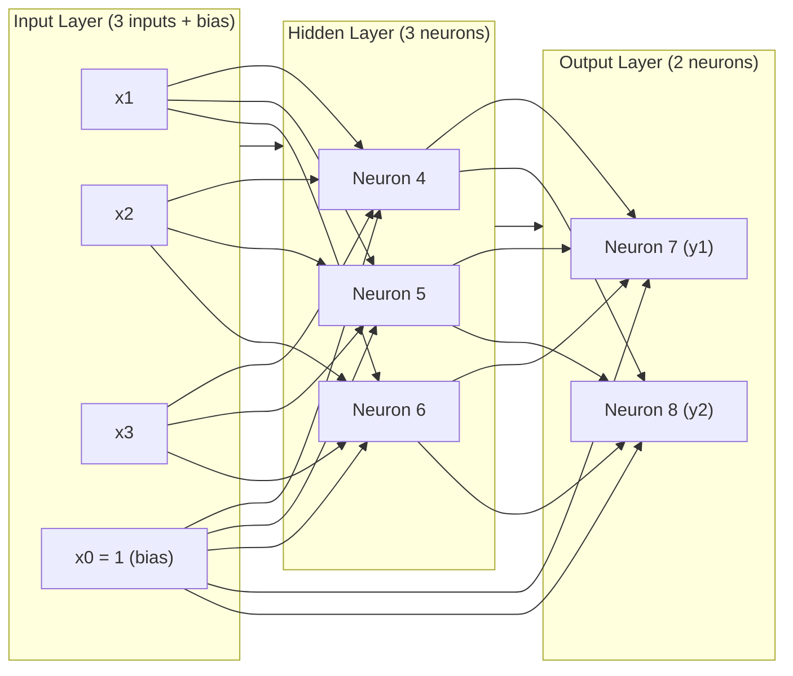

# Backpropagation Neural Network
- Course: CMP2020M – Artificial Intelligence
- Institution: University of Lincoln
- Grade Received: 91%
- Language: Python 3
- Libraries used: math (built-in), matplotlib (visualisation only)

# Overview
This project implements the backpropagation algorithm from scratch for a multi-layer artificial neural network. The implementation does not use any machine learning libraries (e.g., TensorFlow, PyTorch, scikit-learn) – all calculations, including forward propagation, backward propagation, weight updates, and activation functions, are written manually.

# Network Architecture

Layer	Neurons	Activation Function
Input	3 (x1, x2, x3) + bias (x0 = 1)	N/A
Hidden	4, 5, 6	Sigmoid
Output	7 (y1), 8 (y2)	Linear (then Softmax for probability)

# Key Features
- Pure Python implementation – no ML frameworks
- Sigmoid activation function – 1 / (1 + e^(-net))
- Backpropagation algorithm – error gradients propagated backwards
- Weight updates – gradient descent with learning rate η = 0.1
- Softmax probability distribution – for classification outputs
- Learning curve visualisation – squared error over epochs
- Overfitting detection – training termination analysis

# Training Data
The network was trained on 6 input-output pairs:

Inputs	Target Outputs
| x1 | x2 | x3 | Target y1 | Target y2 |
|----|----|----|-----------|-----------|
| 0.50 | 1.00 | 0.75 | 1 | 0 |
| 1.00 | 0.50 | 0.75 | 1 | 0 |
| 1.00 | 1.00 | 1.00 | 1 | 0 |
| -0.01 | 0.50 | 0.25 | 0 | 1 |
| 0.50 | -0.25 | 0.13 | 0 | 1 |
| 0.01 | 0.02 | 0.05 | 0 | 1 |

# Initial Weights
Hidden Layer Weights (to neurons 4, 5, 6)
| To Neuron 4 | | To Neuron 5 | | To Neuron 6 | |
|-------------|-|-------------|-|-------------|-|
| **Weight** | **Value** | **Weight** | **Value** | **Weight** | **Value** |
| w04 | 0.90 | w05 | 0.45 | w06 | 0.36 |
| w14 | 0.74 | w15 | 0.13 | w16 | 0.68 |
| w24 | 0.80 | w25 | 0.40 | w26 | 0.10 |
| w34 | 0.35 | w35 | 0.97 | w36 | 0.96 |

Output Layer Weights (to neurons 7, 8)
| To Neuron 7 | | To Neuron 8 | |
|-------------|-|-------------|-|
| **Weight** | **Value** | **Weight** | **Value** |
| w07 | 0.98 | w08 | 0.92 |
| w47 | 0.35 | w48 | 0.80 |
| w57 | 0.50 | w58 | 0.13 |
| w67 | 0.90 | w68 | 0.80 |

# Results

## Probability Distribution for Unseen Input

Test input vector: `{x1 = 0.3, x2 = 0.7, x3 = 0.9}`

| Epochs | P(Neuron 7 / y1) | P(Neuron 8 / y2) |
|--------|------------------|------------------|
| 10 | 0.4271 | 0.5729 |
| 100 | 0.6366 | 0.3634 |
| 200 | 0.6412 | 0.3588 |
| 1000 | 0.6500 | 0.3500 |

The network classifies the unseen input as **y1** (Class 1) after sufficient training (≥100 epochs).

## Learning Curve & Training Termination

Analysis of the learning curve shows that error decreases rapidly in the first 100 epochs, with minimal improvement beyond that point. Training beyond 100 epochs risks overfitting to noise in the training data.

**Recommended stopping point:** 100 epochs

## Grade Achieved: 91%

This grade reflects correct implementation of backpropagation from scratch, accurate weight initialization, proper activation functions, and thorough analysis of training termination criteria.

